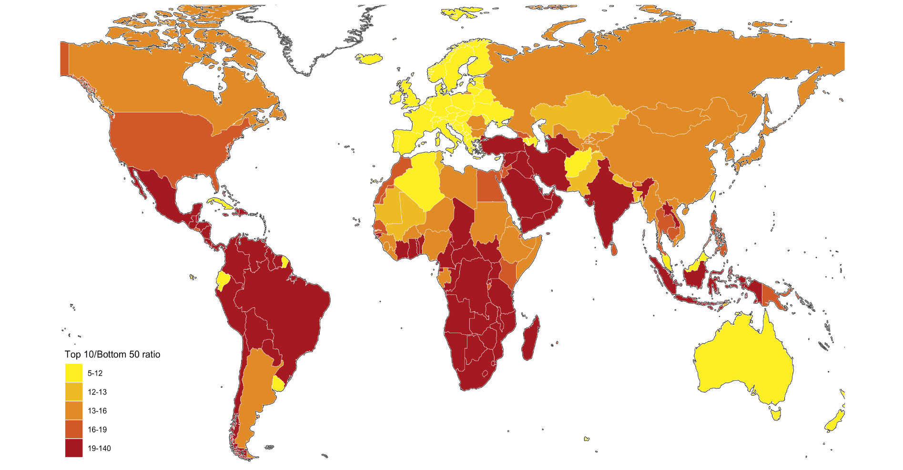

# Introduction

In this note, we study how to construct charts presented in World Inequality Report. We focus on the Executive Summary, however, we hope that you can study the report in more detail using the original data provided in the site.

## WIR2022

* World Inequality Report: https://wir2022.wid.world/
* Executive Summary: https://wir2022.wid.world/executive-summary/
* Methodology: https://wir2022.wid.world/methodology/

There is an R package to make it easier to download the data.

* [R package to download data from the WID.world database](https://github.com/thomasblanchet/wid-r-tool)


# Executive Summary

## Setup

```{r setup, include=FALSE}
Sys.setenv(LANG = "en")
dir.create("data")
```


* Data: https://wir2022.wid.world/www-site/uploads/2022/03/WIR2022TablesFigures-Summary.xlsx
* Data are in Excel format and charts are also created in Excel.

```{r}
library(tidyverse)
library(readxl)
library(DT)
```

```{r summary-data, cash = TRUE, eval = FALSE}
url_summary <- "https://wir2022.wid.world/www-site/uploads/2022/03/WIR2022TablesFigures-Summary.xlsx"
download.file(url = url_summary, destfile = "data/WIR2022TablesFigures-Summary.xlsx") 
```

```{r summary-data-sheet, cash = TRUE}
summary_sheets <- excel_sheets("data/WIR2022TablesFigures-Summary.xlsx")
summary_sheets
```

* Note that some of the sheet names contain a period.

```{r}
df_index <- read_excel("data/WIR2022TablesFigures-Summary.xlsx", sheet = "Index")
df_index
```
* The list of the titles of the tables and the figures.

## Data and Charts

### F1: Global income and wealth inequality, 2021

```{r data-f1, cash = TRUE}
df_f1 <- read_excel("data/WIR2022TablesFigures-Summary.xlsx", sheet = "data-F1")
df_f1
```

```{r}
df_f1 %>% select(cat = ...1, 2:4) %>%
  pivot_longer(2:4, names_to = "group", values_to = "value") %>%
  ggplot(aes(x = cat, y = value, fill = group)) +
  geom_col(position = "dodge") + 
  scale_y_continuous(labels = scales::percent_format(accuracy = 1)) +
  labs(title = "Figure 1. Global income and wealth inequality, 2021",
       x = "", y = "Share of total income or wealth", fill = "")
```
**Interpretation**: The global bottom 50% captures 8.5% of total income measured at Purchasing Power Parity (PPP). The global bottom 50% owns 2% of wealth (at Purchasing Power Parity). The global top 10% owns 76% of total Household wealth and captures 52% of total income in 2021. Note that top wealth holders are not necessarily top income holders. Incomes are measured after the operation of pension and unemployment systems and before taxes and transfers.   
**Sources and series**: wir2022.wid.world/methodology.

#### Explanation
##### Step 1.

* The chart does not use Top 1% data.
* There are two groups, Income and Wealth. We need to tidy the data using `pivot_longer`.

```{r}
df_f1 %>% select(cat = ...1, 2:4) %>%
  pivot_longer(2:4, names_to = "group", values_to = "value")
```
##### Step 2.

Now we use `ggplot2` to draw a chart.

```{r}
df_f1 %>% select(cat = ...1, 2:4) %>%
  pivot_longer(2:4, names_to = "level", values_to = "value") %>%
  ggplot(aes(x = cat, y = value, fill = level)) +
  geom_col()
```

##### Step 3.

* In order to place side by side, we use an option `position = dodge`.

```{r}
df_f1 %>% select(cat = ...1, 2:4) %>%
  pivot_longer(2:4, names_to = "group", values_to = "value") %>%
  ggplot(aes(x = cat, y = value, fill = group)) +
  geom_col(position = "dodge")
```
##### Step 4.

* We use the percent scale on y-axis.

```{r}
df_f1 %>% select(cat = ...1, 2:4) %>%
  pivot_longer(2:4, names_to = "group", values_to = "value") %>%
  ggplot(aes(x = cat, y = value, fill = group)) +
  geom_col(position = "dodge") + 
  scale_y_continuous(labels = scales::percent_format(accuracy = 1))
```

##### Step 5.

* Add the title and the label of the y-axis, and erase the label of the x-axis and the legend.

```{r}
df_f1 %>% select(cat = ...1, 2:4) %>%
  pivot_longer(2:4, names_to = "group", values_to = "value") %>%
  ggplot(aes(x = cat, y = value, fill = group)) +
  geom_col(position = "dodge") + 
  scale_y_continuous(labels = scales::percent_format(accuracy = 1)) +
  labs(title = "Figure 1. Global income and wealth inequality, 2021",
       x = "", y = "Share of total income or wealth", fill = "")
```

### F2: The poorest half lags behind: Bottom 50%, middle 40% and top 10% income shares across the world in 2021

```{r data-f2, cash = TRUE}
df_f2 <- read_excel("data/WIR2022TablesFigures-Summary.xlsx", sheet = "data-F2")
df_f2
```

```{r}
df_f2 %>% pivot_longer(3:5, names_to = "level", values_to = "value") %>%
  ggplot(aes(x = iso, y = value, fill = level)) +
  geom_col(position = "dodge") + 
  scale_x_discrete(labels = function(x) stringr::str_wrap(x, width = 10)) +
  scale_y_continuous(labels = scales::percent_format(accuracy = 1)) +
  labs(title = "Figure 2. The poorest half lags behind Bottom 50%, middle 40% \nand top 10% income shares across the world in 2021",
       x = "", y = "Share of national income (%)", fill = "")
```
**Interpretation**: In Latin America, the top 10% captures 55% of national income, compared to 36% in Europe. Income is measured after pension and unemployment contributions and benefits paid and received by individuals but before income taxes and other transfers.   
**Sources and series**: www.wir2022.wid.world/methodology.

#### Explanation
##### Step 1.

* Similar to F1.

```{r}
df_f2 %>% pivot_longer(3:5, names_to = "level", values_to = "value")
```

##### Step 2.

Since the title is very long inserted `\n` for line break. If `\n and`, then it creates a space before `and`.

```{r}
df_f2 %>% pivot_longer(3:5, names_to = "level", values_to = "value") %>%
  ggplot(aes(x = iso, y = value, fill = level)) +
  geom_col(position = "dodge") + 
  scale_y_continuous(labels = scales::percent_format(accuracy = 1)) +
  labs(title = "Figure 2. The poorest half lags behind Bottom 50%, middle 40% \nand top 10% income shares across the world in 2021",
       x = "", y = "Share of national income (%)", fill = "")
```

##### Step 3.

The labels of x-axis are overlapping. One way is to add `angle`. See below. Another way is to use 
`scale_x_discrete(labels = function(x) stringr::str_wrap(x, width = 10))` to wrap. Since label varies we use a function with a variable x. See above.

```{r}
df_f2 %>% pivot_longer(3:5, names_to = "level", values_to = "value") %>%
  ggplot(aes(x = iso, y = value, fill = level)) +
  geom_col(position = "dodge") + 
  theme(axis.text.x = element_text(angle = 30, vjust = 1, hjust=1)) + 
  scale_y_continuous(labels = scales::percent_format(accuracy = 1)) +
  labs(title = "Figure 2. The poorest half lags behind Bottom 50%, middle 40% \nand top 10% income shares across the world in 2021",
       x = "", y = "Share of national income (%)", fill = "")
```

### F3: Top 10/Bottom 50 income gaps across the world, 2021


```{r data-f3, cash = TRUE}
df_f3 <- read_excel("data/WIR2022TablesFigures-Summary.xlsx", sheet = "data-F3")
df_f3
```


```{r}
df_f3$Country[df_f3$Country == "DR Congo"] <- "Democratic Republic of the Congo"
df_f3$Country[df_f3$Country == "Congo"] <- "Republic of Congo"
df_f3$Country[df_f3$Country == "Russian Federation"] <- "Russia"

df_f3 %>% 
  mutate(`Top 10 Bottom 50 Ratio` = cut(T10B50,breaks = c(5, 12, 13, 16, 19,140), include.lowest = TRUE)) %>%
  ggplot(aes(map_id = Country)) + geom_map(aes(fill = `Top 10 Bottom 50 Ratio`), map = world_map) + expand_limits(x = world_map$long, y = world_map$lat) +
  labs(title = "Figure 3. Top 10/Bottom 50 income gaps across the world, 2021",
       x = "", y = "", fill = "Top 10/Bottom 50 ratio") +
  theme(legend.position="bottom") + 
  scale_fill_brewer(palette='YlOrRd')
```
**Interpretation**: In Brazil, the bottom 50% earns 29 times less than the top 10%. The value is 7 in France. Income is measured after pension and unemployment payments and benefits received by individuals but before other taxes they pay and transfers they receive. Source and series: wir2022.wid.world/methodology.

#### Explanation
##### Step 1.

```{r data-f3-2, cash=TRUE}
df_f3 <- read_excel("data/WIR2022TablesFigures-Summary.xlsx", sheet = "data-F3")
df_f3
```

We use `world_map` data. Let us look at the data first.

```{r}
world_map
```

Let us try using the standard template of `ggplot`. We use `Country` for `map_id` and `T10B50` for numerical data. Since `world_map` data contains `long` and `lat` of each region, we assign them as `expand_limit`.

```{r}
df_f3 %>% 
  ggplot(aes(map_id = Country)) + 
  geom_map(aes(fill = `T10B50`), map = world_map) +
  expand_limits(x = world_map$long, y = world_map$lat)
```

##### Step 2.

We observe a couple of issues by comparing with the image of the original.



1. Russia and Congo areas are void.
2. Scale and the legend should be improved.
3. It may be better to bring the legend at the bottom to provide more width to the world map.

The region name and the country name may be different in two datasets `world_map` and `df_f3`. Let us take care of the first issue.

In order to search names, we use `DT::datatable`, i.e., `datatable` in `DT` package. 

```{r}
datatable(df_f3)
```
Search for 'russia' and 'congo', we find that 

* Russian Federation = Russia in `world_map`
* DR Congo = Democratic Republic of the Congo in `world_map`
* Congo = Republic of Congo in `world_map`

```{r}
df_f3_rev <- df_f3
df_f3_rev$Country[df_f3_rev$Country == "Russian Federation"] <- "Russia"
df_f3_rev$Country[df_f3_rev$Country == "DR Congo"] <- "Democratic Republic of the Congo"
df_f3_rev$Country[df_f3_rev$Country == "Congo"] <- "Republic of Congo"
```

Now check the country names again.

```{r}
datatable(df_f3_rev)
```


```{r}
df_f3_rev %>% 
  ggplot(aes(map_id = Country)) + 
  geom_map(aes(fill = `T10B50`), map = world_map) +
  expand_limits(x = world_map$long, y = world_map$lat)
```


##### Step 3.

Next we add a new column `Top 10 Bottom 50 Ratio` by setting new breaks of `T10B50`.
Place the legend at the bottom using `theme(legend.position="bottom")`.

```{r}
df_f3_rev %>% 
  mutate(`Top 10 Bottom 50 Ratio` = cut(T10B50, breaks = c(5, 12, 13, 16, 19, 140), include.lowest = TRUE)) %>%
  ggplot(aes(map_id = Country)) + geom_map(aes(fill = `Top 10 Bottom 50 Ratio`), map = world_map) + expand_limits(x = world_map$long, y = world_map$lat) +
  theme(legend.position="bottom")
```

##### Step 4.

Finally add the title, remove x and y labels, and change the legend name.

```{r}
df_f3_rev %>% 
  mutate(`Top 10 Bottom 50 Ratio` = cut(T10B50, breaks = c(5, 12, 13, 16, 19, 140), include.lowest = TRUE)) %>%
  ggplot(aes(map_id = Country)) + geom_map(aes(fill = `Top 10 Bottom 50 Ratio`), map = world_map) + expand_limits(x = world_map$long, y = world_map$lat) +
  labs(title = "Figure 3. Top 10/Bottom 50 income gaps across the world, 2021",
       x = "", y = "", fill = "Top 10/Bottom 50 ratio") +
  theme(legend.position="bottom")
```

##### Step 5.

If you want to change color palette, see:

* https://ggplot2.tidyverse.org/reference/scale_brewer.html
* http://www.cookbook-r.com/Graphs/Colors_(ggplot2)/

```{r}
df_f3_rev %>% 
  mutate(`Top 10 Bottom 50 Ratio` = cut(T10B50, breaks = c(5, 12, 13, 16, 19, 140), include.lowest = TRUE)) %>%
  ggplot(aes(map_id = Country)) + geom_map(aes(fill = `Top 10 Bottom 50 Ratio`), map = world_map) + expand_limits(x = world_map$long, y = world_map$lat) +
  labs(title = "Figure 3. Top 10/Bottom 50 income gaps across the world, 2021",
       x = "", y = "", fill = "Top 10/Bottom 50 ratio") +
  theme(legend.position="bottom") +
  scale_fill_brewer(palette='YlOrRd')
```


### F4: The extreme concentration of capital: wealth inequality across the world, 2021

```{r data-f4, cash = TRUE}
df_f4 <- read_excel("data/WIR2022TablesFigures-Summary.xlsx", sheet = "data-F4")
df_f4
```


```{r}
df_f4 %>% pivot_longer(3:5, names_to = "level", values_to = "value") %>%
  ggplot(aes(x = iso, y = value, fill = level)) +
  geom_col(position = "dodge") + 
  scale_x_discrete(labels = function(x) stringr::str_wrap(x, width = 10)) +
  scale_y_continuous(labels = scales::percent_format(accuracy = 1)) +
  labs(title = "Figure 4. The extreme concentration of capital: \nwealth inequality across the world, 2021",
       x = "", y = "Share of national wealth (%)", fill = "")
```
**Interpretation**:  The Top 10% in Latin America captures 77% of total household wealth, versus 22% for the Middle 40% and 1% for the Bottom 50%. In Europe, the Top 10% owns 58% of total wealth, versus 38% for the Middle 40% and 4% for the Bottom 50%.   
**Sources and series**: wir2022.wid.world/methodology.

#### Explanation

Almost the same as F1 and F2.

* Wrap long label: `scale_x_discrete(labels = function(x) stringr::str_wrap(x, width = 10))`
* Per Cent: `scale_y_continuous(labels = scales::percent_format(accuracy = 1))`

### F5: Global income inequality: T10/B50 ratio, 1820-2020

```{r data-f5, cash = TRUE}
df_f5 <- read_excel("data/WIR2022TablesFigures-Summary.xlsx", sheet = "data-F5")
df_f5
```

```{r}
df_f5 %>% select(year = y, ratio = t10b50) %>%
  ggplot(aes(x = year, y = ratio)) + 
  lims(y = c(10,70)) + 
  stat_smooth(span = 0.25, se = FALSE) + 
  scale_x_continuous(breaks = round(seq(1820, 2020, by = 20),1)) + 
  labs(title = "Figure 5. Global income inequality:T10/B50 ratio, 1820-2020", 
       x = "", y = stringr::str_wrap("Ratio of top 10% average income to bottom 50% average income", width = 35)) +
  annotate("text", x = 1840, y = 32, label = stringr::str_wrap("1820: average income of the global top 10% is 18x higher than average income of the bottom 50%", width = 20), size = 3) + 
  annotate("text", x = 1910, y = 49, label = stringr::str_wrap("1910: average income of the global top 10% is 41x higher than average income of the bottom 50%", width = 20), size = 3) +
    annotate("text", x = 1980, y = 60, label = stringr::str_wrap("1980: average income of the global top 10% is 53x higher than average income of the bottom 50%", width = 20), size = 3) +
    annotate("text", x = 2010, y = 32, label = stringr::str_wrap("2020: average income of the global top 10% is 38x higher than average income of the bottom 50%", width = 20), size = 3)
```
**Interpretation**. Global inequality, as measured by the ratio T10/B50 between the average income of the top 10% and the average income of the bottom 50%, more than doubled between between 1820 and 1910, from less than 20 to about 40, and stabilized around 40 between 1910 and 2020. It is too early to say whether the decline in global inequality observed since 2008 will continue. Income is measured per capita after pension and unemployement insurance transfers and before income and wealth taxes.   
**Sources and series**: wir2022.wid.world/lmethodology and Chancel and Piketty (2021)..

#### Explanation

##### Step 1.

The following is enough. Here we applied `str_wrap` to the label of y-axis as it is very long.

```{r}
df_f5 %>% select(year = y, ratio = t10b50) %>%
  ggplot(aes(x = year, y = ratio)) + 
  geom_line() +
  labs(title = "Figure 5. Global income inequality:T10/B50 ratio, 1820-2020", 
       x = "", y = stringr::str_wrap("Ratio of top 10% average income to bottom 50% average income", width = 35))
```

##### Step 2.

There are many way of smoothing.


**Line Plot and LOESS**

```{r}
df_f5 %>% select(year = y, ratio = t10b50) %>%
  ggplot(aes(x = year, y = ratio)) +
  geom_line() +
  geom_smooth(method = "loess", se = FALSE) + 
  labs(title = "Figure 5. Global income inequality:", 
       subtitle = "T10/B50 ratio, 1820-2020",
       x = "", y = "Ratio of top 10% average income to bottom 50% average income")
```

**GAM Smoothing with 24 Points**

```{r}
df_f5 %>% select(year = y, ratio = t10b50) %>%
  ggplot(aes(x = year, y = ratio)) +
  stat_smooth(method = "gam", formula = y ~ s(x, k = 24), se = FALSE) + 
  scale_x_continuous(breaks = round(seq(min(df_f5$y), max(df_f5$y), by = 20),1)) + 
  labs(title = "Figure 5. Global income inequality:T10/B50 ratio, 1820-2020", 
       x = "", y = stringr::str_wrap("Ratio of top 10% average income to bottom 50% average income", width = 35))
```

**Polynomial Approximation of Degree 6**

```{r}
df_f5 %>% select(year = y, ratio = t10b50) %>%
  ggplot(aes(x = year, y = ratio)) +
  geom_point() +
  geom_smooth(method = "lm", formula = y ~ poly(x, 6), se = FALSE) + 
  labs(title = "Figure 5. Global income inequality:", 
       subtitle = "T10/B50 ratio, 1820-2020",
       x = "", y = stringr::str_wrap("Ratio of top 10% average income to bottom 50% average income", width = 35))
```

##### Step 3.

In the main chart for F5, we applied `stat_smooth(span = 0.25, se = FALSE)` as it is easy. You can adjust smoothness by changing the value for `span`.

For y-axis, following the output provided, `lims(y = c(10,70))` is added and annotation.

For a long text use: `stringr::str_wrap("long text", width = size)` and `annotate` with `size = fontsize`.

`ggforce::geom_mark_rect` will add annotation in a box.


### F6: Global income inequality: Between vs. Within country inequality (Theil index), 1820-2020

```{r data-f6, cash = TRUE}
df_f6 <- read_excel("data/WIR2022TablesFigures-Summary.xlsx", sheet = "data-F6")
df_f6
```


```{r}
df_f6 %>% select(year = "...1", 2:3) %>%
  pivot_longer(cols = 2:3, names_to = "type", values_to = "value") %>%
  mutate(types = factor(type, levels = c("Within-country inequality", "Between-country inequality"))) %>%
  ggplot(aes(x = year, y = value, fill = types)) +
  geom_area() +
  scale_y_continuous(labels = scales::percent_format(accuracy = 1)) +
  scale_x_continuous(breaks = round(seq(1820, 2020, by = 20),1)) + 
  scale_fill_manual(values=rev(scales::hue_pal()(2)), labels = function(x) str_wrap(x, width = 15)) +
  labs(title = "Figure 6. Global income inequality: \nBetween vs. within country inequality (Theil index), 1820-2020",
       x = "", y = "Share of global inequality (% of total Theil index)", fill = "") + 
  annotate("text", x = 1850, y = 0.28, label = stringr::str_wrap("1820: Between country inequality represents 11% of global inequality", width = 20), size = 3) + 
  annotate("text", x = 1980, y = 0.70, label = stringr::str_wrap("1980: Between country inequality represents 57% of global inequality", width = 20), size = 3) +
  annotate("text", x = 1990, y = 0.30, label = stringr::str_wrap("2020: Between country inequality represents 32% of global inequality", width = 20), size = 3)
```

Legend can be placed at the bottom: `theme(legend.position="bottom")`

```{r}
df_f6 %>% select(year = "...1", 2:3) %>%
  pivot_longer(cols = 2:3, names_to = "type", values_to = "value") %>%
  mutate(types = factor(type, levels = c("Within-country inequality", "Between-country inequality"))) %>%
  ggplot(aes(x = year, y = value, fill = types)) +
  geom_area() +
  scale_y_continuous(labels = scales::percent_format(accuracy = 1)) +
  scale_x_continuous(breaks = round(seq(1820, 2020, by = 20),1)) + 
  scale_fill_manual(values=rev(scales::hue_pal()(2))) +
  labs(title = "Figure 6. Global income inequality: \nBetween vs. within country inequality (Theil index), 1820-2020",
       x = "", y = "Share of global inequality (% of total Theil index)", fill = "") + 
  annotate("text", x = 1850, y = 0.28, label = stringr::str_wrap("1820: Between country inequality represents 11% of global inequality", width = 20), size = 3) + 
  annotate("text", x = 1980, y = 0.70, label = stringr::str_wrap("1980: Between country inequality represents 57% of global inequality", width = 20), size = 3) +
    annotate("text", x = 1990, y = 0.30, label = stringr::str_wrap("2020: Between country inequality represents 32% of global inequality", width = 20), size = 3) +
  theme(legend.position="bottom")
```
**Interpretation**. The importance of between-country inequality in overall global inequality, as measured by the Theil index, rose between 1820 and 1980 and strongly declined since then. In 2020, between-country inequality makes-up about a third of global inequality between individuals. The rest is due to inequality within countries. Income is measured per capita after pension and unemployement insurance transfers and before income and wealth taxes.   
**Sources and series**: wir2022.wid.world/methodology and Chancel and Piketty (2021).

#### Explanation

##### Step 1.

We use `geom_area`.

```{r}
df_f6 %>% select(year = "...1", 2:3) %>%
  pivot_longer(cols = 2:3, names_to = "type", values_to = "value") %>%
  ggplot(aes(x = year, y = value, fill = type)) +
  geom_area() +
  scale_y_continuous(labels = scales::percent_format(accuracy = 1)) +
  labs(title = "Figure 6. Global income inequality: \nBetween vs. within country inequality (Theil index), 1820-2020",
       x = "", y = "Share of global inequality (% of total Theil index)")
```

##### Step 2.

Since the order of the two groups are different, the following linw is added.
```
scale_fill_manual(values=rev(scales::hue_pal()(2)), labels = function(x) str_wrap(x, width = 15))
```
The second option is to control the legend to wrap.

Annotation can be omitted if we use RMarkdown to explain the charts clearly.

```{r}
df_f6 %>% select(year = "...1", 2:3) %>%
  pivot_longer(cols = 2:3, names_to = "type", values_to = "value") %>%
  mutate(types = factor(type, levels = c("Within-country inequality", "Between-country inequality"))) %>%
  ggplot(aes(x = year, y = value, fill = types)) +
  geom_area() +
  scale_y_continuous(labels = scales::percent_format(accuracy = 1)) +
  scale_x_continuous(breaks = round(seq(1820, 2020, by = 20),1)) + 
  scale_fill_manual(values=rev(scales::hue_pal()(2)), labels = function(x) str_wrap(x, width = 15)) +
  labs(title = "Figure 6. Global income inequality: \nBetween vs. within country inequality (Theil index), 1820-2020",
       x = "", y = "Share of global inequality (% of total Theil index)", fill = "")
```

### F7: Global income inequality, 1820-2020

```{r data-f7, cash = TRUE}
df_f7 <- read_excel("data/WIR2022TablesFigures-Summary.xlsx", sheet = "data-F7")
df_f7
```

```{r}
df_f7 %>% select(year = y, 2:4) %>%
  pivot_longer(cols = 2:4, names_to = "type", values_to = "value") %>%
  ggplot(aes(x = year, y = value, color = type)) +
  stat_smooth(span = 0.25, se = FALSE) +
  scale_x_continuous(breaks = round(seq(1820, 2020, by = 20),1)) +
  scale_y_continuous(labels = scales::percent_format(accuracy = 1)) +
  labs(title = "Figure 7. Global income inequality, 1820-2020", 
       x = "", y = " Share of total world income (%)", color = "") +
  annotate("text", x = 1980, y = 0.20, label = stringr::str_wrap("The global bottom 50% income share remains historically low despite growth in the emerging world in the past decades.", width = 30), size = 3)
```
**Interpretation**. The share of global income going to top 10% highest incomes at the world level has fluctuated around 50-60% between 1820 and 2020 (50% in 1820, 60% in 1910, 56% in 1980, 61% in 2000, 55% in 2020), while the share going to the bottom 50% lowest incomes has generally been around or below 10% (14% in 1820, 7% in 1910, 5% in 1980, 6% in 2000, 7% in 2020). Global inequality has always been very large. It rose between 1820 and 1910 and shows little long-run trend between 1910 and 2020. Distribution of per capita incomes. Sources and series: see wir2022.wid.world/methodology and Chancel and Piketty (2021).

#### Explanation

##### Step 1.

Use `pivot_longer` to tidy the data.

```{r}
df_f7 %>% select(year = y, 2:4) %>%
  pivot_longer(cols = 2:4, names_to = "type", values_to = "value") 
```
##### Step 2.

Use `stat_smooth` with `span`, and change the scale of x-axis and y-axis.

```{r}
df_f7 %>% select(year = y, 2:4) %>%
  pivot_longer(cols = 2:4, names_to = "type", values_to = "value") %>%
  ggplot(aes(x = year, y = value, color = type)) +
  stat_smooth(span = 0.25, se = FALSE) +
  scale_x_continuous(breaks = round(seq(1820, 2020, by = 20),1)) +
  scale_y_continuous(labels = scales::percent_format(accuracy = 1)) +
  labs(title = "Figure 7. Global income inequality, 1820-2020", 
       x = "", y = " Share of total world income (%)", color = "")
```
Finally, add the annotation to obtain the figure above.

### F8: The rise of private versus the decline of public wealth in rich countries, 1970-2020

```{r data-f8, cash = TRUE}
df_f8 <- read_excel("data/WIR2022TablesFigures-Summary.xlsx", sheet = "data-F8")
df_f8
```
```{r}
df_f8 %>% 
  select(year, Germany_public = Germany, Germany_private = 'Germany (private)', 
         Spain_public = Spain, Spain_private = 'Spain (private)', 
         France_public = France, France_private = 'France (private)', 
         UK_public  = UK, UK_private = 'UK (private)', 
         Japan_public = Japan, Japan_private = 'Japan (private)', 
         Norway_public = Norway, Norway_private = 'Norway (private)',
         USA_public = USA, USA_private = 'USA (private)') %>%
  pivot_longer(!year, names_to = c("country",".value"), names_sep = "_") %>%
  pivot_longer(3:4, names_to = "type", values_to = "value") %>%
  ggplot() +
  stat_smooth(aes(x = year, y = value, color = country, linetype = type), span = 0.25, se = FALSE, size=0.75) +
  scale_y_continuous(labels = scales::percent_format(accuracy = 1)) +
  labs(title = "Figure 8. The rise of private versus the decline of public wealth in rich countries, 1970-2020", 
       x = "", y = "wealth as as % of national income", color = "", type = "")
```
**Interpretation**: Public wealth is the sum of all financial and non-financial assets, net of debts, held by governments. Public wealth dropped from 60% of national income in 1970 to -106% in 2020 in the UK.   
**Sources and series**: wir2022.wid.world/methodology, Bauluz et al. (2021) and updates.

#### Explanation

##### Step 1.

There are two types of groups, countries and public vs private. So we change the column names first to identify that classification easily. We delete the last two columns "gwealAVGRICH" and  "pwealAVGRICH" as they will not appear in the chart.

```{r}
df_f8 %>% 
  select(year, Germany_public = Germany, Germany_private = 'Germany (private)', 
         Spain_public = Spain, Spain_private = 'Spain (private)', 
         France_public = France, France_private = 'France (private)', 
         UK_public  = UK, UK_private = 'UK (private)', 
         Japan_public = Japan, Japan_private = 'Japan (private)', 
         Norway_public = Norway, Norway_private = 'Norway (private)',
         USA_public = USA, USA_private = 'USA (private)') 
```

##### Step 2. 

First separate the countries into a new column.

```{r}
df_f8 %>% 
  select(year, Germany_public = Germany, Germany_private = 'Germany (private)', 
         Spain_public = Spain, Spain_private = 'Spain (private)', 
         France_public = France, France_private = 'France (private)', 
         UK_public  = UK, UK_private = 'UK (private)', 
         Japan_public = Japan, Japan_private = 'Japan (private)', 
         Norway_public = Norway, Norway_private = 'Norway (private)',
         USA_public = USA, USA_private = 'USA (private)') %>%
  pivot_longer(!year, names_to = c("country",".value"), names_sep = "_") 
```
##### Step 3.

Next apply `pivot_longer`  again to form the second group.

```{r}
df_f8 %>% 
  select(year, Germany_public = Germany, Germany_private = 'Germany (private)', 
         Spain_public = Spain, Spain_private = 'Spain (private)', 
         France_public = France, France_private = 'France (private)', 
         UK_public  = UK, UK_private = 'UK (private)', 
         Japan_public = Japan, Japan_private = 'Japan (private)', 
         Norway_public = Norway, Norway_private = 'Norway (private)',
         USA_public = USA, USA_private = 'USA (private)') %>%
  pivot_longer(!year, names_to = c("country",".value"), names_sep = "_") %>%
  pivot_longer(3:4, names_to = "type", values_to = "value")
```
##### Step 4.

Assign colors to countries and distinguish types by `linetype`.

```{r}
df_f8 %>% 
  select(year, Germany_public = Germany, Germany_private = 'Germany (private)', 
         Spain_public = Spain, Spain_private = 'Spain (private)', 
         France_public = France, France_private = 'France (private)', 
         UK_public  = UK, UK_private = 'UK (private)', 
         Japan_public = Japan, Japan_private = 'Japan (private)', 
         Norway_public = Norway, Norway_private = 'Norway (private)',
         USA_public = USA, USA_private = 'USA (private)') %>%
  pivot_longer(!year, names_to = c("country",".value"), names_sep = "_") %>%
  pivot_longer(3:4, names_to = "type", values_to = "value") %>%
  ggplot() +
  stat_smooth(aes(x = year, y = value, color = country, linetype = type), span = 0.25, se = FALSE)
```

##### Step 5.

Change the line width by `size`, change the y-axis to percents and add the title.

```{r}
df_f8 %>% 
  select(year, Germany_public = Germany, Germany_private = 'Germany (private)', 
         Spain_public = Spain, Spain_private = 'Spain (private)', 
         France_public = France, France_private = 'France (private)', 
         UK_public  = UK, UK_private = 'UK (private)', 
         Japan_public = Japan, Japan_private = 'Japan (private)', 
         Norway_public = Norway, Norway_private = 'Norway (private)',
         USA_public = USA, USA_private = 'USA (private)') %>%
  pivot_longer(!year, names_to = c("country",".value"), names_sep = "_") %>%
  pivot_longer(3:4, names_to = "type", values_to = "value") %>%
  ggplot() +
  stat_smooth(aes(x = year, y = value, color = country, linetype = type), span = 0.25, se = FALSE, size=0.75) +
  scale_y_continuous(labels = scales::percent_format(accuracy = 1)) +
  labs(title = "Figure 8. The rise of private versus the decline of public wealth in rich countries, 1970-2020", 
       x = "", y = "wealth as as % of national income", color = "", type = "")
```

##### Step 6.

Let us check if we use only color for each group representing columns. This is not the chart we wanted to obtain.

```{r}
df_f8 %>% 
  pivot_longer(!year, names_to = "group", values_to = "value") %>%
  ggplot() +
  stat_smooth(aes(x = year, y = value, color = group), span = 0.25, se = FALSE, size=0.75) +
  scale_y_continuous(labels = scales::percent_format(accuracy = 1)) +
  labs(title = "Figure 8. The rise of private versus the decline of public wealth in rich countries, 1970-2020", 
       x = "", y = "wealth as as % of national income", color = "")
```

### F9: Average annual wealth growth rate, 1995-2021

Original


```{r data-f9, cash = TRUE}
df_f9 <- read_excel("data/WIR2022TablesFigures-Summary.xlsx", sheet = "data-F9")
df_f9
```
```{r}
df_f9 %>% select(p, wealth = 'Wealth growth 1995-2021') %>%
  ggplot() +
  stat_smooth(aes(x = p, y = wealth), span = 0.25, se = FALSE) +
#  scale_x_continuous(breaks = round(c(seq(0, 90, by = 10), 99.9, 99.99, 99.999,3))) +
  scale_y_continuous(labels = scales::percent_format(accuracy = 1)) +
  labs(title = "Figure 9. Average annual wealth growth rate, 1995-2021", 
       x = "←1% poorest                               Global wealth group                                 0.001% richest→", y = "Per adult annual growth rate in wealth, net of inflation (%)", color = "")
```
**Interpretation**: Growth rates among the poorest half of the population were between 3% and 4% per year, between 1995 and 2021. Since this group started from very low wealth levels, its absolute levels of growth remained very low. The poorest half of the world population only captured 2.3% of overall wealth growth since 1995. The top 1%  benefited from high growth rates (3% to 9% per year). This group captured 38% of total wealth growth between 1995 and 2021. Net household wealth is equal to the sum of financial assets (e.g. equity or bonds) and non-financial assets (e.g. housing or land) owned by individuals, net of their debts.   
**Sources and series**: wir2022.wid.world/methodology.


#### Explanation

##### Step 1.

```{r data-f9-2, cash = TRUE}
df_f9 <- read_excel("data/WIR2022TablesFigures-Summary.xlsx", sheet = "data-F9")
df_f9
```

```{r}
df_f9_rev <- df_f9 %>% mutate(pp = 1/(100-p))
df_f9_rev
```

```{r}
df_f9_rev %>% select(pp, wealth = 'Wealth growth 1995-2021') %>%
  ggplot() +
  stat_smooth(aes(x = pp, y = wealth), span = 0.25, se = FALSE) +
#  scale_x_continuous(breaks = round(c(seq(0, 90, by = 10), 99.9, 99.99, 99.999,3))) +
  scale_y_continuous(labels = scales::percent_format(accuracy = 1)) +
  labs(title = "Figure 9. Average annual wealth growth rate, 1995-2021", 
       x = "←1% poorest                               Global wealth group                                 0.001% richest→", y = "Per adult annual growth rate in wealth, net of inflation (%)", color = "")
```
##### Step 2.

```{r}
df_f9 %>% select(p, wealth = 'Wealth growth 1995-2021') %>%
  ggplot() +
  geom_point(aes(x = p, y = wealth)) +
#  scale_x_continuous(breaks = round(c(seq(0, 90, by = 10), 99.9, 99.99, 99.999,3))) +
  scale_y_continuous(labels = scales::percent_format(accuracy = 1)) +
  labs(title = "Figure 9. Average annual wealth growth rate, 1995-2021", 
       x = "←1% poorest                               Global wealth group                                 0.001% richest→", y = "Per adult annual growth rate in wealth, net of inflation (%)", color = "")
```

_Not Yet_

### F10: The share of wealth owned by the global 0.1% and billionaires, 2021

```{r data-f10, cash = TRUE}
df_f10 <- read_excel("data/WIR2022TablesFigures-Summary.xlsx", sheet = "data-F10")
df_f10
```

```{r}
df_f10 %>% 
  select(year, "Global Billionaire Wealth" = bn_hhweal, "Top 0.01%" = top0.1_hhweal) %>%
  pivot_longer(!year, names_to = "group",".value", values_to = "value") %>%
  ggplot() +
  stat_smooth(aes(x = year, y = value, color = group), span = 0.25, se = FALSE) +
  scale_x_continuous(breaks = round(seq(1995, 2020, by = 5),1)) +
  scale_y_continuous(labels = scales::percent_format(accuracy = 1)) +
  scale_color_manual(values=rev(scales::hue_pal()(2))) +
  labs(title = "Figure 10. Extreme wealth inequality: \nthe rise of global billionaires and top 0.01%, 1995-2021", 
       x = "", y = "Share of total household wealth (%)", color = "")
```
**Interpretation**: The share of wealth detained by the world's billionaires rose from 1% of total household wealth in 1995 to nearly 3.5% today. The threshold of top 0.01%, composed of 520 000 adults, grew from €693,000 (PPP) in 1995 to €16,666,000 today. The net household wealth is equal to the sum of financial assets (e.g. equity or bonds) and non-financial assets (e.g. housing or land) owned by individuals, net of their debts.   
**Sources and series**: wir2022.wid.world/methodology, Bauluz et al. (2021) and updates.

#### Explanation

##### Step 1.

Use descriptive column names and use `pivot_longer` to make it tidy.

```{r}
df_f10 %>% 
  select(year, "Global Billionaire Wealth" = bn_hhweal, "Top 0.01%" = top0.1_hhweal) %>%
  pivot_longer(!year, names_to = "group",".value", values_to = "value")
```

##### Step 2.

Use `stat_smooth` with `span = 0.25` and change the breaks of x-labels.

```{r}
df_f10 %>% 
  select(year, "Global Billionaire Wealth" = bn_hhweal, "Top 0.01%" = top0.1_hhweal) %>%
  pivot_longer(!year, names_to = "group",".value", values_to = "value") %>%
  ggplot() +
  stat_smooth(aes(x = year, y = value, color = group), span = 0.25, se = FALSE) +
  scale_x_continuous(breaks = round(seq(1995, 2020, by = 5),1)) +
  scale_y_continuous(labels = scales::percent_format(accuracy = 1)) +
  labs(title = "Figure 10. Extreme wealth inequality: \nthe rise of global billionaires and top 0.01%, 1995-2021", 
       x = "", y = "Share of total household wealth (%)", color = "")
```

##### Step 3.

Swap the colors by `scale_color_manual(values=rev(scales::hue_pal()(2)))`. If `n` is the number of colors used `scales::hue_pal()(n)` returns the RGB color codes used. By `rev`, the order is reversed. See https://ggplot2.tidyverse.org/reference/scale_hue.html.

```{r}
df_f10 %>% 
  select(year, "Global Billionaire Wealth" = bn_hhweal, "Top 0.01%" = top0.1_hhweal) %>%
  pivot_longer(!year, names_to = "group",".value", values_to = "value") %>%
  ggplot() +
  stat_smooth(aes(x = year, y = value, color = group), span = 0.25, se = FALSE) +
  scale_x_continuous(breaks = round(seq(1995, 2020, by = 5),1)) +
  scale_y_continuous(labels = scales::percent_format(accuracy = 1)) +
  scale_color_manual(values=rev(scales::hue_pal()(2))) +
  labs(title = "Figure 10. Extreme wealth inequality: \nthe rise of global billionaires and top 0.01%, 1995-2021", 
       x = "", y = "Share of total household wealth (%)", color = "")
```

### F11: Top 1% vs bottom 50% wealth shares in Western Europe and the US, 1910-2020

```{r data-f11, cash = TRUE}
df_f11 <- read_excel("data/WIR2022TablesFigures-Summary.xlsx", sheet = "data-F11")
df_f11
```

```{r}
df_f11 %>% 
  rename(!year, US_bot50 = USbot50, US_top1 = UStop1, EU_bot50 = EUbot50, EU_top1 = EUtop1) %>%
  pivot_longer(!year, names_to = c("group",".value"), names_sep = "_") %>%
  pivot_longer(3:4, names_to = "type", values_to = "value") %>%
  ggplot() +
  stat_smooth(aes(x = year, y = value, color = group, linetype = type), span = 0.25, se = FALSE) +
  scale_x_continuous(breaks = round(seq(1910, 2020, by = 10),1)) +
  scale_y_continuous(labels = scales::percent_format(accuracy = 1)) +
  labs(title = "Figure 11. Top 1% vs bottom 50% wealth shares \n in Western Europe and the US, 1910-2020", 
       x = "", y = "Share of total personal wealth (%)", color = "", linetype = "") +
  scale_linetype_manual(values = c("dotted","solid")) +
  annotate("text", x = 2000, y = 0.50, label = stringr::str_wrap("Wealth inequality has been rising at different speeds after a historical decline. The bottom 50% has always been extremely low.", width = 30), size = 3)
```
**Interpretation**: The graph presents decennal averages of top 1% personal wealth shares in Western Europe and the US. Between 1910 and 2020, the top 1% was 55% on average in Europe vs. 43% in the US. A century later, the US is almost back to its early 20th century level. Sources and series: wir2022.wid.world/methodology.

#### Explanation

##### Step 1.

There are two types of groups, US vs EU and bot50 and top1. We use the same technique as in F8.

```{r}
df_f11 %>% 
  rename(!year, US_bot50 = USbot50, US_top1 = UStop1, EU_bot50 = EUbot50, EU_top1 = EUtop1) %>%
  pivot_longer(!year, names_to = c("group",".value"), names_sep = "_")
```
##### Step 2.

Here, we try another way. Here we use two `stat_smooth` with different `aes()`.
Can you see the difference of the chart above?

```{r}
df_f11 %>% 
  rename(!year, US_bot50 = USbot50, US_top1 = UStop1, EU_bot50 = EUbot50, EU_top1 = EUtop1) %>%
  pivot_longer(!year, names_to = c("group",".value"), names_sep = "_") %>%
  ggplot() +
  stat_smooth(aes(x = year, y = top1, color = group), span = 0.25, se = FALSE) +
  stat_smooth(aes(x = year, y = bot50, color = group), span = 0.25, se = FALSE, linetype = 2) +
  scale_x_continuous(breaks = round(seq(1910, 2020, by = 10),1)) +
  scale_y_continuous(labels = scales::percent_format(accuracy = 1)) +
  labs(title = "Figure 11. Top 1% vs bottom 50% wealth shares \n in Western Europe and the US, 1910-2020", 
       x = "", y = "Share of total personal wealth (%)", color = "") +
  annotate("text", x = 2000, y = 0.50, label = stringr::str_wrap("Wealth inequality has been rising at different speeds after a historical decline. The bottom 50% has always been extremely low.", width = 30), size = 3)
```
##### Step 3.

Use `pivot_longer` the second time.

```{r}
df_f11 %>% 
  rename(!year, US_bot50 = USbot50, US_top1 = UStop1, EU_bot50 = EUbot50, EU_top1 = EUtop1) %>%
  pivot_longer(!year, names_to = c("group",".value"), names_sep = "_") %>%
  pivot_longer(3:4, names_to = "type", values_to = "value") %>%
  ggplot() +
  stat_smooth(aes(x = year, y = value, color = group, linetype = type), span = 0.25, se = FALSE) +
  scale_x_continuous(breaks = round(seq(1910, 2020, by = 10),1)) +
  scale_y_continuous(labels = scales::percent_format(accuracy = 1)) +
  labs(title = "Figure 11. Top 1% vs bottom 50% wealth shares \n in Western Europe and the US, 1910-2020", 
       x = "", y = "Share of total personal wealth (%)", color = "", linetype = "") +
  annotate("text", x = 2000, y = 0.50, label = stringr::str_wrap("Wealth inequality has been rising at different speeds after a historical decline. The bottom 50% has always been extremely low.", width = 30), size = 3)
```
##### Step 4. 

Change the order of linetypes manually.

```{r}
df_f11 %>% 
  rename(!year, US_bot50 = USbot50, US_top1 = UStop1, EU_bot50 = EUbot50, EU_top1 = EUtop1) %>%
  pivot_longer(!year, names_to = c("group",".value"), names_sep = "_") %>%
  pivot_longer(3:4, names_to = "type", values_to = "value") %>%
  ggplot() +
  stat_smooth(aes(x = year, y = value, color = group, linetype = type), span = 0.25, se = FALSE) +
  scale_x_continuous(breaks = round(seq(1910, 2020, by = 10),1)) +
  scale_y_continuous(labels = scales::percent_format(accuracy = 1)) +
  labs(title = "Figure 11. Top 1% vs bottom 50% wealth shares \n in Western Europe and the US, 1910-2020", 
       x = "", y = "Share of total personal wealth (%)", color = "", linetype = "") +
  scale_linetype_manual(values = c("dotted","solid")) +
  annotate("text", x = 2000, y = 0.50, label = stringr::str_wrap("Wealth inequality has been rising at different speeds after a historical decline. The bottom 50% has always been extremely low.", width = 30), size = 3)
```

### F12: Female share in global labor incomes, 1990-2020

```{r data-f12, cash = TRUE}
df_f12 <- read_excel("data/WIR2022TablesFigures-Summary.xlsx", sheet = "data-F12")
df_f12
```

```{r}
df_f12 %>% 
  select(year = "Data needs to be updated", value = ...2) %>%
  filter(!is.na(year)) %>%
  ggplot(aes(x = year, y = value)) +
  geom_col(width = 0.5, fill = scales::hue_pal()(2)[2]) +
  geom_hline(yintercept = 0.5, linetype = 2, colour = scales::hue_pal()(2)[1]) +
  scale_y_continuous(labels = scales::percent_format(accuracy = 1)) +
  labs(title = "Figure 12. Female share in global labor incomes, 1990-2020", 
        x = "", y = "") +
  annotate("text", x = 1, y = 0.48, label = "Gender parity", size = 3) +
  annotate("text", x = 5.2, y = 0.47, label = stringr::str_wrap("Women make only 35% of global labor incomes, men make the remaining  65%.", width = 40), size = 3)
```
**Interpretation**: The share of female incomes in global labour incomes was 31% in 1990 and nears 35% in 2015-2020. Today, males make up 65% of total labor incomes. Sources and series: wir2022.wid.world/methodology and Neef and Robilliard (2021).

#### Explanation

##### Step 1.

Change the column names and delete the rows with NAs.

```{r}
df_f12 %>% 
  select(year = "Data needs to be updated", value = ...2) %>%
  filter(!is.na(year))
```

##### Step 2.

Add `geom_col` and  `geom_hline` with colors `scales::hue_pal()(2)[2]` and `scales::hue_pal()(2)[1]`.

```{r}
df_f12 %>% 
  select(year = "Data needs to be updated", value = ...2) %>%
  filter(!is.na(year)) %>%
  ggplot(aes(x = year, y = value)) +
  geom_col(width = 0.5, fill = scales::hue_pal()(2)[2]) +
  geom_hline(yintercept = 0.5, linetype = 2, colour = scales::hue_pal()(2)[1]) +
  scale_y_continuous(labels = scales::percent_format(accuracy = 1)) +
  labs(title = "Figure 12. Female share in global labor incomes, 1990-2020", 
        x = "", y = "") +
  annotate("text", x = 1, y = 0.48, label = "Gender parity", size = 3) +
  annotate("text", x = 5.2, y = 0.47, label = stringr::str_wrap("Women make only 35% of global labor incomes, men make the remaining  65%.", width = 40), size = 3)
```

### F13: Female labor income share across the world, 1990-2020

Note that the sheet name of F13 has period at the end. Note that `summary_sheets[30] = ``r summary_sheets[30]` with a period.

```{r data-f13, cash = TRUE}
df_f13 <- read_excel("data/WIR2022TablesFigures-Summary.xlsx", sheet = "data-F13.")
df_f13
```

```{r}
df_f13 %>% pivot_longer(2:9, names_to = "region", values_to = "value") %>%
  ggplot(aes(x = region, y = value, fill = ...1)) +
  geom_col(position = "dodge") + 
  geom_hline(yintercept = 0.5, linetype = 2, colour = "red") +
  scale_x_discrete(labels = function(x) stringr::str_wrap(x, width = 12)) +
  scale_y_continuous(labels = scales::percent_format(accuracy = 1)) +
  labs(title = "Figure 13. Female labor income share across the world, 1990-2020", 
        x = "", y = "", fill = "") +
  annotate("text", x = 1.2, y = 0.48, label = "Gender parity", size = 3)
```
**Interpretation**: The female labour income share rose from 34% to 38% in North America between 1990 and 2020. Sources and series: wir2022.wid.world/methodology and Neef and Robilliard (2021).

#### Explanation

Not so difficult.

### F14: Global carbon inequality, 2019. Group contribution to world emissions (%)

Note that the sheet name of F14 has period at the end. Note that `summary_sheets[31] = ``r summary_sheets[31]` with a period.

```{r data-f14, cash = TRUE}
df_f14 <- read_excel("data/WIR2022TablesFigures-Summary.xlsx", sheet = "data-F14.")
df_f14
```

* `\n` for line break in the title.

```{r}
df_f14 %>% 
  ggplot(aes(x = Group, y = Share)) +
  geom_col(width = 0.5, fill = scales::hue_pal()(1)[1]) + 
  scale_y_continuous(labels = scales::percent_format(accuracy = 1)) +
  labs(title = "Figure 14. Global carbon inequality, \n2019 Group contribution to world emissions (%)", 
       x = "", y = "Share of world emissions (%)")
```

**Interpretation**: Personal carbon footprints include emissions from domestic consumption, public and private investments as well as imports and exports of carbon embedded in goods and services traded with the rest of the world. Modeled estimates based on the systematic combination of tax data, household surveys and input-output tables. Emissions split equally within households. Sources and series: wir2022.wid.world/methodology and Chancel (2021).

#### Explanation

Not so difficult. You can assign color name. See http://www.cookbook-r.com/Graphs/Colors_(ggplot2)/.

### F15: Per capita emissions acriss the world, 2019

```{r data-f15, cash = TRUE}
df_f15 <- read_excel("data/WIR2022TablesFigures-Summary.xlsx", sheet = "data-F15")
df_f15
```
```{r}
df_f15 %>% mutate(region = rep(regionWID[!is.na(regionWID)], each = 3)) %>%
  select(region, group, tcap) %>%
  ggplot(aes(x = region, y = tcap, fill = group)) +
  geom_col(position = "dodge") + 
  scale_x_discrete(labels = function(x) stringr::str_wrap(x, width = 10)) +
  labs(title = "Figure 15 Per capita emissions across the world, 2019", 
       x = "", y = "tonnes of CO2e per person per year", fill = "")
```
**Interpretation**: Personal carbon footprints include emissions from domestic consumption, public and private investments as well as imports and exports of carbon embedded in goods and services traded with the rest of the world. Modeled estimates based on the systematic combination of tax data, household surveys and input-output tables. Emissions split equally within households. Sources and series: wir2022.wid.world/methodology and Chancel (2021).

#### Explanation

##### Step 1. 

It is in Excel stype and there are missing values in the first column. In order to add a new column, let us check the following.

```{r}
region_test <- rep(df_f15$regionWID[!is.na(df_f15$regionWID)], each = 3)
region_test
```

##### Step 2.

Add the names of the region in the last column by `mutate` and choose columns by `select`.

```{r}
df_f15 %>% mutate(region = rep(regionWID[!is.na(regionWID)], each = 3))
```

```{r}
df_f15 %>% mutate(region = rep(regionWID[!is.na(regionWID)], each = 3)) %>%
  select(region, group, tcap)
```

##### Step 3.

Now it is not difficult to draw a chart.

```{r}
df_f15 %>% mutate(region = rep(regionWID[!is.na(regionWID)], each = 3)) %>%
  select(region, group, tcap) %>%
  ggplot(aes(x = region, y = tcap, fill = group)) +
  geom_col(position = "dodge") + 
  scale_x_discrete(labels = function(x) stringr::str_wrap(x, width = 10)) +
  labs(title = "Figure 15 Per capita emissions across the world, 2019", 
       x = "", y = "tonnes of CO2e per person per year", fill = "")
```

### T1 Global millionaires and billionaires, 2021

Check the format of the sheet and add `skip=4, n_max=7`.

```{r T1}
df_t1 <- read_excel("data/WIR2022TablesFigures-Summary.xlsx", 
                    sheet = "T1", skip = 4, n_max = 7)
df_t1
```
**Interpretation**: In 2021, there were 62.2 million people in the world owning more than $1 million (measured at Market Exchange Rates). Their average wealth was $ 2.8 million, representing a total of  $174 trillion. In our Tax scenario 2, a global progressive wealth tax would yield 2.1% of global income, taking into account capital depreciation and evasion. Sources and series: wir2022.wid.world/methodology.

